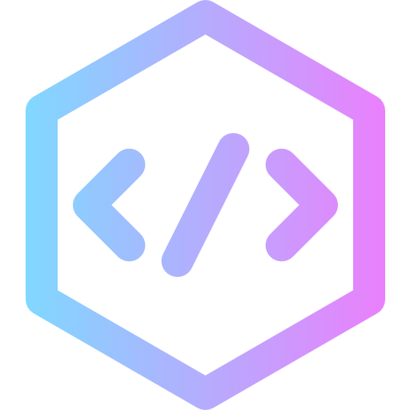

<p align="center">
  
</p>

# C41.ch-be

> A modern, enterprise-grade blog management system built with Laravel 13, React 19 (Inertia.js), and PostgreSQL. Featuring a professional UI/UX, comprehensive security, and optimized performance.

[](https://www.php.net/)
[](https://laravel.com/)
[](https://react.dev/)
[](https://www.typescriptlang.org/)
[](https://www.postgresql.org/)
[](https://tailwindcss.com/)
[](./tests)
[](LICENSE)

## 📋 Table of Contents

- [Operational Quickstart](#operational-quickstart)
- [Overview](#overview)
- [Features](#features)
- [Tech Stack](#tech-stack)
- [Requirements](#requirements)
- [Installation](#installation)
- [Security](#security)
- [Documentation](#documentation)
- [CI/CD](#cicd)
- [Testing](#testing)
- [Architecture](#architecture)
- [Project Status](#project-status)
- [Default Users](#default-users-development)
- [Useful Commands](#useful-commands)
- [Before Pushing to GitHub](#before-pushing-to-github)
- [Contributing](#contributing)
- [Author](#author)
- [License](#license)

---

<a id="operational-quickstart"></a>
## ⚙️ Operational Quickstart

Use these commands from the **repository root** as your main entrypoints:

| Command | Purpose |
|--------|---------|
| `composer run dev` | Start Laravel server, Vite dev server, queue worker and logs for local development. |
| `npm run build:frontend && php artisan test` | Build frontend assets (Vite manifest) and run the full PHPUnit test suite (Feature + Unit). |
| `npm run lint && npm run types` | Run ESLint (strict rules) and TypeScript type checking (`tsc --noEmit`). |
| `composer audit && npm audit` | Check dependency vulnerabilities (Composer + npm). |
| `composer run setup` | First-time setup: installs deps, copies `.env`, generates key, migrates, installs JS deps, builds assets. |

**Default dev URL:** `http://127.0.0.1:8000` (Laravel).

For Vite HMR, the dev server runs on its default port (see terminal output).  
Default Vite dev URL: `http://localhost:5173`.

For detailed docs: start from [docs/README.md](docs/README.md).

For a full local quality gate before pushing, see [Before Pushing to GitHub](#before-pushing-to-github).

<a id="overview"></a>
## 🎯 Overview

c41.ch-be is a production-ready content management system designed for modern blog management. It combines the power of Laravel's robust backend with React's reactive frontend, delivering a seamless, performant, and secure blogging experience.

### Key Highlights

- **Modern Stack**: Laravel 13, React 19, TypeScript, TailwindCSS 4.2
- **Professional UI/UX**: Enhanced with skeleton loaders, real-time previews, advanced filtering, and accessibility compliance
- **Enterprise Security**: Authorization policies, rate limiting, HTML sanitization, and role-based access control
- **Optimized Performance**: Database indexing, strategic caching, query optimization, and React memoization
- **Comprehensive Testing**: 57 tests with 241 assertions covering all critical paths
- **Full Documentation**: API docs, development guide, roadmap, and English code comments throughout

<a id="features"></a>
## ✨ Features

### 🔐 Security & Stability

- ✅ **Authorization Policies** — Granular access control (PostPolicy, CategoryPolicy)
- ✅ **Form Request Validation** - Comprehensive input validation and sanitization
- ✅ **HTML Sanitization** - HTMLPurifier integration to prevent XSS attacks
- ✅ **Rate Limiting** - Configurable throttling on sensitive endpoints
- ✅ **Soft Deletes** - Data recovery capability for posts and categories
- ✅ **Role-Based Access Control** - Admin/User roles with policy enforcement
- ✅ **CSRF Protection** - Built-in Laravel CSRF token validation

### ⚡ Performance

- ✅ **Database Indexing** - Optimized indexes on frequently queried columns
- ✅ **Strategic Caching** - Multi-level caching (5-10 minute TTL) for dashboard, posts, and categories
- ✅ **Query Optimization** - Eager loading, specific column selection, and optimized joins
- ✅ **React Performance** - Memoized components, optimized re-renders (60-70% reduction)
- ✅ **Configurable Pagination** - Flexible pagination (15, 25, 50, 100 items per page)
- ✅ **Image Optimization** - Efficient image upload with progress tracking

### 🎨 User Experience & Interface

- ✅ **Skeleton Loaders** - Professional loading states for all async operations
- ✅ **Real-Time Preview** - Live preview system with modal and split-view modes
- ✅ **Advanced Filtering** - Saved filter presets with localStorage persistence
- ✅ **Enhanced Dashboard** - Custom charts (Bar, Pie, Line) without external dependencies
- ✅ **Rich Text Editor** - Tiptap WYSIWYG editor with tables, code blocks, links, images
- ✅ **Image Upload** - Progress indicators, preview, and error handling
- ✅ **Command Palette** - Global search with keyboard shortcuts (Cmd/Ctrl+K)
- ✅ **Floating Action Button** - Quick access to create posts
- ✅ **Enhanced Notifications** - Toast system with animations and visual feedback
- ✅ **Mobile Responsive** - Fully optimized for mobile devices
- ✅ **Accessibility (A11y)** - WCAG 2.1 AA compliance with ARIA labels and keyboard navigation

### 🛠️ Functionality

- ✅ **WYSIWYG Editor** - Full-featured editor with tables, code blocks, links, images
- ✅ **Tags System** - Functional tagging with validation and limits
- ✅ **Real-Time Search** - Debounced search across posts, categories, and users
- ✅ **Image Management** - Upload system with progress tracking and preview
- ✅ **Complete SEO** - Meta tags, Open Graph, Twitter Cards, Sitemap XML
- ✅ **Category Management** - Full CRUD with color coding and post associations
- ✅ **Post Management** - Create, edit, delete, publish, feature posts
- ✅ **User Management** - Role-based user system with admin capabilities
- ✅ **Activity Logging** - Event-driven activity tracking

### 🏗️ Code Quality

- ✅ **Service Layer Architecture** - Clean separation of concerns
- ✅ **Repository Pattern** - Data access abstraction
- ✅ **Event-Driven Architecture** - 6 events, 2 listeners for activity logging
- ✅ **Dependency Injection** - Proper IoC container usage
- ✅ **SOLID Principles** - Clean, maintainable, and extensible code
- ✅ **TypeScript** - Full type safety across frontend
- ✅ **English Documentation** - Code comments and docblocks in English
- ✅ **Comprehensive Testing** - 57 tests, 241 assertions

### 👥 Target users & use cases

- **Content / marketing teams**: organizations that need a **modern blog CMS** with rich editing, previews, SEO and publishing workflows, without having to build infrastructure from scratch.
- **Agencies and freelancers**: developers who want a reusable, high-quality **Laravel + React (Inertia)** starter for content-heavy sites, with batteries included for auth, roles, SEO and media management.
- **Product & growth teams**: teams that experiment frequently with blog content and landing pages and need real-time preview, command palette, advanced filters and analytics-ready data.
- **Engineering teams (Laravel + SPA)**: teams looking for a reference implementation of layered architecture (Controller → Service → Repository → Model) with strong testing and CI/CD practices.

<a id="tech-stack"></a>
## 🛠 Tech Stack

### Backend
- **Framework**: Laravel 13
- **Language**: PHP 8.4+
- **Database**: PostgreSQL 14+
- **Authentication**: Laravel Fortify
- **Validation**: Form Request classes
- **Sanitization**: HTMLPurifier

### Frontend
- **Framework**: React 19 with Inertia.js
- **Language**: TypeScript 5.9
- **Styling**: TailwindCSS 4.2
- **UI Components**: Radix UI primitives
- **Editor**: Tiptap (WYSIWYG)
- **Icons**: Lucide React
- **Build Tool**: Vite 7

### Development Tools
- **Testing**: PHPUnit 13
- **Code Quality**: ESLint 10, Prettier, Laravel Pint
- **Package Manager**: Composer, NPM
- **Process Manager**: Concurrently

<a id="requirements"></a>
## 📦 Requirements

- **PHP** >= 8.4
- **PostgreSQL** >= 14
- **Node.js** >= 22.0.0
- **Composer** >= 2.0
- **NPM** >= 10.0

<a id="installation"></a>
## 🚀 Installation

### 1. Clone the Repository

```bash
git clone https://github.com/adrirubim/c41.ch-be.git
cd c41.ch-be
```

### 2. Install Dependencies

```bash
# Install PHP dependencies
composer install

# Install Node dependencies
npm ci
```

### 3. Environment Configuration

```bash
# Copy environment file
cp .env.example .env

# Generate application key
php artisan key:generate
```

### 4. Database Setup

Configure your database in `.env` (use your own credentials; never commit `.env`):

```env
DB_CONNECTION=pgsql
DB_HOST=127.0.0.1
DB_PORT=5432
DB_DATABASE=c41
DB_USERNAME=postgres
DB_PASSWORD=
```

### 5. Run Migrations and Seeders

```bash
# Run migrations and seed database
php artisan migrate:fresh --seed
```

### 6. Create Storage Link

```bash
# Create symbolic link for public storage
php artisan storage:link
```

### 7. Start Development Servers

```bash
# Start all services (Laravel, Vite, Queue, Logs)
composer run dev
```

This command starts:
- **Laravel Server** on `http://127.0.0.1:8000`
- **Vite Dev Server** on `http://localhost:5173`
- **Queue Worker** for background jobs
- **Log Tailer** for real-time logs

<a id="security"></a>
## 🔒 Security

- **Never commit `.env`** — It is in `.gitignore`; use `.env.example` as a template and set your own `APP_KEY`, `DB_*`, and other secrets locally or via your deployment environment.
- **Default users** — Created by `DatabaseSeeder` for development only. Use `SEEDER_ADMIN_PASSWORD` / `SEEDER_TEST_PASSWORD` in `.env` if needed, and change or remove these users before production.
- **Production** — Set `APP_DEBUG=false`, use strong `APP_KEY`, restrict `APP_URL`, and configure proper DB and mail credentials outside the repository.

<a id="documentation"></a>
## 📚 Documentation

All documentation lives under `docs/`. The main index is [docs/README.md](docs/README.md). This table lists the most important topics:

| Doc | Description |
|-----|-------------|
| [docs/README.md](docs/README.md) | Documentation index |
| [docs/testing/TEST_DATABASE.md](docs/testing/TEST_DATABASE.md) | Test database (SQLite / PostgreSQL) |
| [docs/TEST_COVERAGE.md](docs/TEST_COVERAGE.md) | Test suites and coverage |
| [DEPLOYMENT](docs/deployment/README.md) | Server and shared hosting deployment |
| [DEVELOPMENT_GUIDE](docs/DEVELOPMENT_GUIDE.md) | Architecture, conventions |
| [ARCHITECTURE_GUIDELINES](docs/ARCHITECTURE_GUIDELINES.md#15-2026-enterprise-quality-checklist) | 2026 Enterprise Quality Checklist (mandatory) |
| [API](docs/API.md) | Endpoints and authentication |
| [FRONTEND_COMPONENTS](docs/FRONTEND_COMPONENTS.md) | React components |
| [CUSTOM_HOOKS](docs/CUSTOM_HOOKS.md) | Custom hooks |
| [TROUBLESHOOTING](docs/TROUBLESHOOTING.md) | Errors and solutions |

For a navigable, high-level overview, you can also use the [GitHub Wiki](https://github.com/adrirubim/c41.ch-be/wiki).

[SECURITY](SECURITY.md) · [LICENSE](LICENSE) · [VERSION_STACK](docs/VERSION_STACK.md)

<a id="cicd"></a>
## 🔄 CI/CD

GitHub Actions runs **tests**, **lint**, **type-checking**, and **production builds** on every push and pull request to `main`:

- **Tests** (`.github/workflows/tests.yml`): PHP 8.4, Node 22, `composer install`, `npm run build:frontend`, `php artisan test` against PostgreSQL `c41_test`
- **Enterprise Quality & CI 2026** (`.github/workflows/lint.yml`):
  - Laravel Pint (PHP)
  - Prettier (frontend)
  - ESLint (React 19 + TS)
  - TypeScript `tsc --noEmit`
  - `npm run build:frontend` (Vite)
  - CI is read-only (no auto-commits / no pushing changes from quality/test workflows)

Note: there is a separate release automation workflow (`.github/workflows/update-license-year.yml`) that may commit a `LICENSE` year update when a GitHub Release is published.

<a id="testing"></a>
## 🧪 Testing

### Run Tests

```bash
# Build frontend first (required for Inertia/Vite in Feature tests)
npm run build:frontend

# Run all tests
php artisan test

# Run specific test suite
php artisan test --filter=PostControllerTest

# Run with coverage (if configured)
php artisan test --coverage
```

### Test Coverage

- ✅ **57 tests** passing
- ✅ **241 assertions** across all test suites
- ✅ **Feature tests** for all controllers
- ✅ **Integration tests** for complex workflows
- ✅ **Authorization tests** for policies
- ✅ **Validation tests** for form requests

### Test Database

- Default is configured in `phpunit.xml` as **SQLite in-memory** (`:memory:`), so you can run tests locally without PostgreSQL (requires PDO SQLite).
- CI runs the same suite against **PostgreSQL** (`c41_test`, user/password `postgres`) in `.github/workflows/tests.yml`.
- Automatically refreshed with `RefreshDatabase` trait
- Isolated test environment

<a id="architecture"></a>
## 🏗 Architecture

The project follows a **layered architecture** with clear separation of concerns:

```
Request → Controller → Service → Repository → Model
                ↓
            Event → Listener
```

### Architecture Layers

1. **Controllers** (`app/Http/Controllers/`)
   - Handle HTTP requests and responses
   - Coordinate services and return Inertia responses
   - Apply middleware and authorization

2. **Services** (`app/Services/`)
   - Business logic and orchestration
   - Event dispatching
   - Cache management
   - Transaction handling

3. **Repositories** (`app/Repositories/`)
   - Data access layer abstraction
   - Complex query building
   - Database interaction

4. **Models** (`app/Models/`)
   - Eloquent models with relationships
   - Accessors and mutators
   - Scopes and query methods

5. **Policies** (`app/Policies/`)
   - Authorization logic
   - Resource access control
   - Role-based permissions

6. **Events/Listeners** (`app/Events/`, `app/Listeners/`)
   - Activity logging
   - Notification triggers
   - Decoupled business logic

### Frontend Architecture

- **Pages** (`resources/js/pages/`) - Inertia page components
- **Components** (`resources/js/components/`) - Reusable UI components
- **Layouts** (`resources/js/layouts/`) - Page layout wrappers
- **Hooks** (`resources/js/hooks/`) - Custom React hooks
- **Types** (`resources/js/types/`) - TypeScript type definitions

<a id="project-status"></a>
## 📊 Project status

**Overall Score: 10/10** - Production-ready, optimized, well-structured, fully tested, and professionally documented

| Aspect | Status | Score | Notes |
|--------|--------|-------|-------|
| Security | ✅ Excellent | 9/10 | Policies, sanitization, rate limiting implemented |
| Performance | ✅ Excellent | 9/10 | Caching, indexes, query optimization, React memoization |
| Code Quality | ✅ Excellent | 10/10 | Clean architecture, SOLID principles, English documentation |
| UX/UI | ✅ Excellent | 10/10 | Enhanced with Phase 1 + Phase 2 + Phase 3 + Public pages with animated background |
| Functionality | ✅ Excellent | 10/10 | All core features + public website implemented and tested |
| Testing | ✅ Excellent | 10/10 | 57 tests, 241 assertions, comprehensive coverage |
| Documentation | ✅ Excellent | 10/10 | API docs, development guide, deployment guide, troubleshooting, frontend components, custom hooks, changelog, English code comments |

### Recent Improvements

**Phase 1 - High Impact (✅ Completed)**
- Skeleton loaders system
- Quick actions system (FAB + keyboard shortcuts)
- Real-time preview system
- Enhanced dashboard with charts
- Enhanced post editor (autosave, word counter)
- Enhanced global search (command palette)
- Mobile responsiveness enhancement

**Phase 2 - Medium Impact (✅ Completed)**
- Smooth animations and transitions
- Advanced filtering system (presets)
- Enhanced notification system
- Media library management (upload improvements)
- Enhanced empty states
- Accessibility (A11y) compliance
- Visual performance optimization
- Enhanced pagination system

**Code Professionalization (✅ Completed)**
- All code comments translated to English
- All PHP docblocks translated to English
- All TypeScript/React comments translated to English
- Consistent professional documentation

<a id="default-users-development"></a>
## ⚠️ Default users (development)

After `php artisan migrate:fresh --seed`, the application creates demo users for local development. Credentials are defined in `database/seeders/DatabaseSeeder.php`.

- **Administrator** — `admin@example.com` · Role: Admin (full access)
- **Standard user** — `test@example.com` · Role: User (own posts only)

**Security:** Change or remove these users before deploying to production. Optional: set `SEEDER_ADMIN_PASSWORD` and `SEEDER_TEST_PASSWORD` in `.env` to override defaults (see [Security](#security)).

<a id="useful-commands"></a>
## 🛠 Useful Commands

### Development

```bash
# Start all development services
composer run dev

# Start Laravel server only
php artisan serve

# Start Vite dev server only
npm run dev:frontend

# Build for production
npm run build:frontend

# Build with SSR
npm run build:ssr
composer run dev:ssr
```

### Database

```bash
# Run migrations
php artisan migrate

# Reset and seed database
php artisan migrate:fresh --seed

# Interactive console
php artisan tinker

# Create new migration
php artisan make:migration create_example_table
```

### Testing

```bash
# Run all tests
php artisan test

# Run specific test
php artisan test --filter=PostControllerTest

# Run with verbose output
php artisan test --verbose
```

### Code Quality

```bash
# Format PHP code
./vendor/bin/pint

# Format JavaScript/TypeScript
npm run format

# Check formatting
npm run format:check

# Lint code
npm run lint

# Type check
npm run types
```

### Cache & Optimization

```bash
# Clear all caches
php artisan optimize:clear

# Clear specific cache
php artisan cache:clear
php artisan config:clear
php artisan route:clear
php artisan view:clear

# Cache configuration
php artisan config:cache
php artisan route:cache
php artisan view:cache
```

### Storage

```bash
# Create symbolic link
php artisan storage:link

# Clear storage
php artisan storage:clear
```

<a id="before-pushing-to-github"></a>
## 📤 Before Pushing to GitHub

This project enforces CI checks via GitHub Actions. To avoid surprises, run the **same commands CI runs** locally.

Prerequisites:

- Install dependencies: `composer install` and `npm ci`
- CI runs tests against PostgreSQL 16 (database `c41_test`). Locally, tests default to **SQLite in-memory** via `phpunit.xml` (requires PDO SQLite).
  - Note: the repository uses `legacy-peer-deps=true` (see `.npmrc`) to keep installs reproducible with the current Vite/Tailwind plugin peer constraints.

### Lint pipeline (matches `.github/workflows/lint.yml`)

```bash
composer install -q --no-ansi --no-interaction --no-scripts --no-progress --prefer-dist
npm ci
vendor/bin/pint
npm run format:check
npm run lint
npm run types
npm run build:frontend
```

### Tests pipeline (matches `.github/workflows/tests.yml`)

```bash
npm ci
composer install --no-interaction --prefer-dist --optimize-autoloader
npm run build:frontend
cp .env.example .env
php artisan key:generate
echo "DB_CONNECTION=pgsql" >> .env
echo "DB_HOST=127.0.0.1" >> .env
echo "DB_PORT=5432" >> .env
echo "DB_DATABASE=c41_test" >> .env
echo "DB_USERNAME=postgres" >> .env
echo "DB_PASSWORD=postgres" >> .env
DB_CONNECTION=pgsql DB_HOST=127.0.0.1 DB_PORT=5432 DB_DATABASE=c41_test DB_USERNAME=postgres DB_PASSWORD=postgres php artisan test
```

Notes:

- `npm run format` is intentionally **not** part of CI; CI enforces formatting via `npm run format:check`.
- If you want auto-formatting locally, run `npm run format` before `npm run format:check`.

### Test database (optional)

By default tests use SQLite (`:memory:`). If you want to run the same PostgreSQL setup as CI (database `c41_test`, user/password `postgres`/`postgres`) without relying on your local PostgreSQL configuration, you can use an ephemeral Docker container (port `5433`).

```bash
docker rm -f c41_test_pg >/dev/null 2>&1 || true
docker run -d --name c41_test_pg -e POSTGRES_USER=postgres -e POSTGRES_PASSWORD=postgres -e POSTGRES_DB=c41_test -p 5433:5432 postgres:16
for i in {1..30}; do docker exec c41_test_pg pg_isready -U postgres >/dev/null 2>&1 && break; sleep 1; done
DB_CONNECTION=pgsql DB_HOST=127.0.0.1 DB_PORT=5433 DB_DATABASE=c41_test DB_USERNAME=postgres DB_PASSWORD=postgres php artisan test
docker rm -f c41_test_pg
```

<a id="contributing"></a>
## 🤝 Contributing

This is an open-source project (MIT). For contributions or inquiries, please contact the author. See **[CONTRIBUTING.md](CONTRIBUTING.md)** for code standards and workflow.

Please note that participation in this project is governed by our **[Code of Conduct](CODE_OF_CONDUCT.md)**.

### Code Standards

- Follow PSR-12 coding standards for PHP
- Use TypeScript for all frontend code (no legacy `.js` for new components/pages)
- Write tests for new features
- Document all public methods
- Keep code comments in English
- Follow SOLID principles

<a id="author"></a>
## 👨‍💻 Author

**Developed by:** [Adrián Morillas Pérez](https://linktr.ee/adrianmorillasperez)

### Connect

- 📧 **Email:** [adrianmorillasperez@gmail.com](mailto:adrianmorillasperez@gmail.com)
- 💻 **GitHub:** [@adrirubim](https://github.com/adrirubim)
- 🌐 **Linktree:** [adrianmorillasperez](https://linktr.ee/adrianmorillasperez)
- 💼 **LinkedIn:** [Adrián Morillas Pérez](https://es.linkedin.com/in/adrianmorillasperez)
- 📱 **Instagram:** [@adrirubim](https://www.instagram.com/adrirubim)
- 📘 **Facebook:** [AdriRubiM](https://www.facebook.com/AdriRubiM/)

---

<a id="license"></a>
## 📄 License

MIT. See [LICENSE](LICENSE) for details.

---

**Last Updated:** March 2026 · **Status:** Production Ready ✅ · **Version:** v3.0.0 · **Stack:** [docs/VERSION_STACK.md](docs/VERSION_STACK.md)
